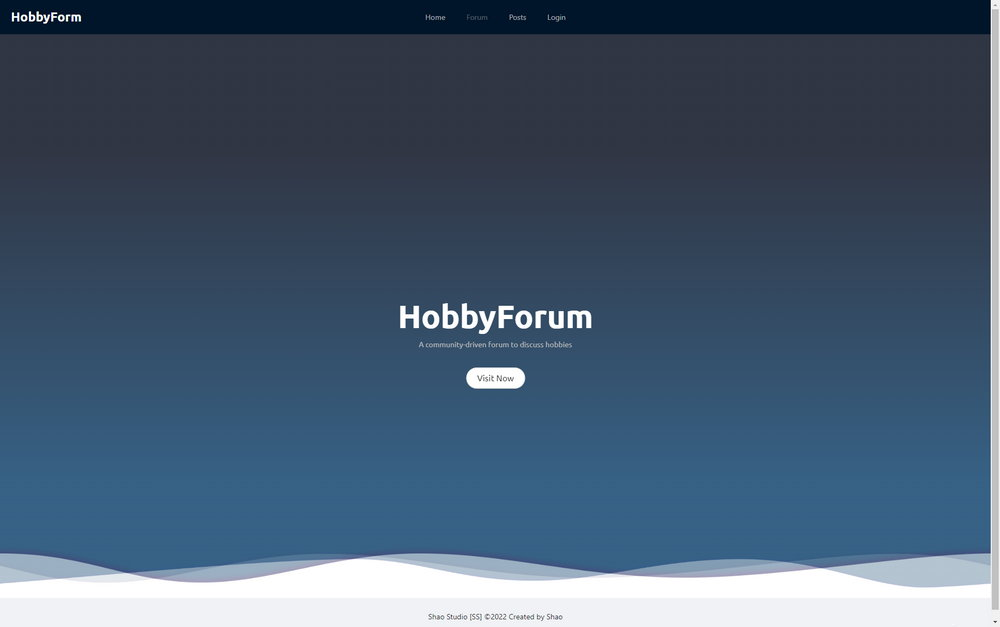
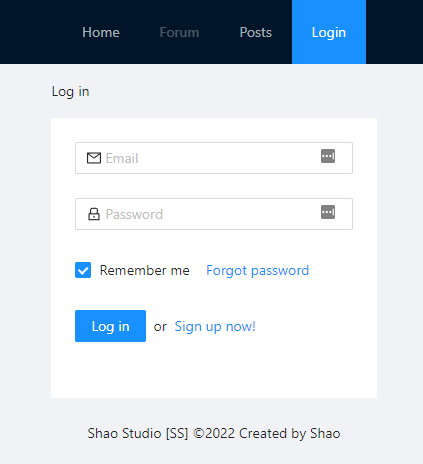

# HobbyForum

Welcome to the hobby forum. This is a community driven forum to discuss hobbies and interests.

As someone from the Traditional Chinese community (zhTW), there are not many forums out there for people to discuss their favourite topics rather than Facebook groups and Discod channels. So the idea was to build a forum system where people can gather around and discuss topics of their interest.

The goal for this project was to create a simple forum and posting system where users can login/logout, create and manage forums, create creative posts and leave comments of other user’s posts.

Due to time limitation, the forum layer of the website is not done yet. But the post management and comment section works fine, with a beautiful HTML editor for your creativity. Enjoy!

## Table of Contents
1. [Setup](#setup)
2. [Technology & Design](#techonologyanddesign)
3. [Links](#links)
4. [Screenshots](#screenshots)
5. [License](#license)

## Setup

You can visit the [deployed website on Heroku](http://aqueous-mountain-77590.herokuapp.com/), or download the codes on [GitHub](https://github.com/shaotangyen/forum-system) and run it on your local machine.

To run on your local machine, you need to run ``npm install && npm build && npm run seed && npm run develop``.

## Technology & Design

Front-End (client side)

* Apollo/Client
* React, Dom
* JWT-Decode
* Ant React (UI, React components)
* Jodit Editor (HTML editor)

Back-End (server side)

* Apollo-Server-Express
* Express
* Graphql
* Node
* Jsonwebtoken

Database

* MongoDB
* Mongoose ODM

Design

* Mobile-responsiveness by manual CSS
* Polished UI
* Animated Landing Page by CSS
* Interactive - accept user input

## Links

Please check out [deployed website on Heroku](http://aqueous-mountain-77590.herokuapp.com/) for the app, or check out [GitHub](https://github.com/shaotangyen/forum-system) for all codes.

## Screenshots

## License

Copyright 2021 Shao Yen

Permission is hereby granted, free of charge, to any person obtaining a copy of this software and associated documentation files (the "Software"), to deal in the Software without restriction, including without limitation the rights to use, copy, modify, merge, publish, distribute, sublicense, and/or sell copies of the Software, and to permit persons to whom the Software is furnished to do so, subject to the following conditions:

The above copyright notice and this permission notice shall be included in all copies or substantial portions of the Software.

THE SOFTWARE IS PROVIDED "AS IS", WITHOUT WARRANTY OF ANY KIND, EXPRESS OR IMPLIED, INCLUDING BUT NOT LIMITED TO THE WARRANTIES OF MERCHANTABILITY, FITNESS FOR A PARTICULAR PURPOSE AND NONINFRINGEMENT. IN NO EVENT SHALL THE AUTHORS OR COPYRIGHT HOLDERS BE LIABLE FOR ANY CLAIM, DAMAGES OR OTHER LIABILITY, WHETHER IN AN ACTION OF CONTRACT, TORT OR OTHERWISE, ARISING FROM, OUT OF OR IN CONNECTION WITH THE SOFTWARE OR THE USE OR OTHER DEALINGS IN THE SOFTWARE.